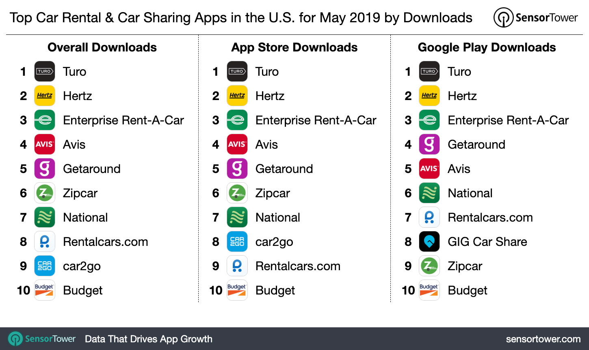

# Price-Prediction-for-Car-Rental--Spatially-Aspect

The global car rental industry is expected to reach an estimated $120 billion by 2025 with a CAGR of 6.1% from 2020 to 2025.
However, after a long search, i was unable to access an open-source project related to it, and the data is also scarce. 

Finally, I found a database file consisted of a 330MB JSON file with a heavily nested format., that was extracted from the **(TURO) website.** consisted of 36000 car rental events. 
therefore I decided to make this project open source. I tried to explain step by step starting from reading the database file and converting it to flatten data through the EDA included the spatial analysis as well. 
and comparing between -`Random Forest and XGBoost`- to predict daily rent rates.
It's also includes how to deal with different data sources as I have added a population dataset. 

I did my best to explain the steps of hyperparameter tuning in details for beginners as well .
Packages used : 
**data visualization** :  
Plotly. 
Seaborn. 
Matplotlib. 
ggplot.

**Spatial analysis:** 
Geoviews . 
Folium . 
go.figure plotly. 
geopandas.

**hyperparameter tuning:**  
GridSearch. 
Randomsearch. 
manually.

To download data [here](https://www.kaggle.com/theriley106/turo-rental-car-pricing-info)
